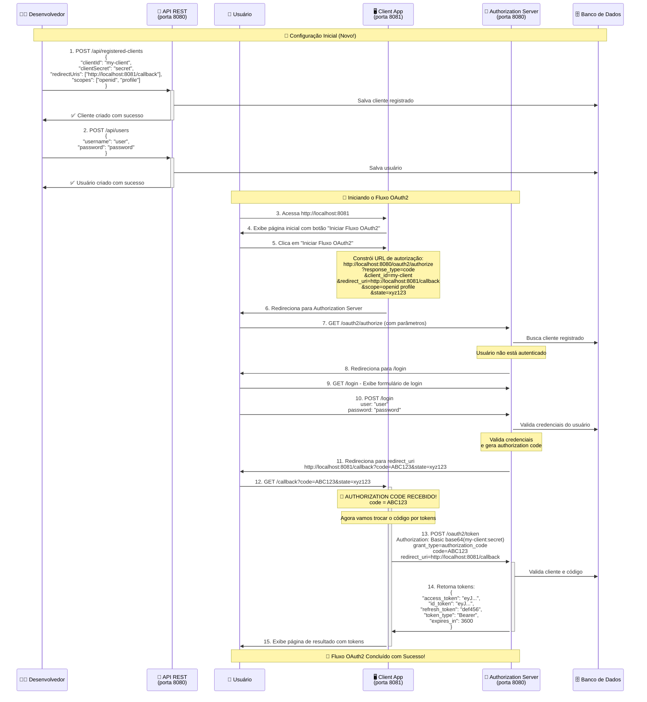

# OAuth2 Authorization Code Flow - Aplicação de Estudo

Este projeto demonstra o fluxo **OAuth2 Authorization Code Grant** usando Spring Authorization Server com persistência JPA e um cliente OAuth2 personalizado.

## 📋 Estrutura do Projeto

- **Authorization Server** (porta 8080) - Servidor que autentica usuários e emite tokens
- **Client Application** (porta 8081) - Aplicação cliente que precisa acessar recursos protegidos
- **Banco de Dados** - Persistência de clientes registrados e usuários via JPA

## 🆕 Novidades desta Versão

- ✅ **Persistência JPA** - Clientes e usuários salvos em banco de dados
- ✅ **APIs REST** - Endpoints para cadastro de clientes e usuários
- ✅ **Configuração Dinâmica** - Não precisa mais configurar clientes em memória

## 🔄 Como Funciona o Fluxo OAuth2

```
1. [NOVO] Cadastre um cliente via API REST
2. [NOVO] Cadastre um usuário via API REST  
3. Usuário acessa Client App (8081)
4. Client redireciona para Authorization Server (8080/oauth2/authorize)
5. Usuário faz login no Authorization Server
6. Authorization Server redireciona de volta com código de autorização
7. Client troca o código por access token
8. Client pode usar o token para acessar recursos
```

### 📊 Diagrama de Sequência Detalhado



## 🚀 Como Executar

### 1. Configurar Banco de Dados
Configure seu `application.yml` com as configurações do banco:

```yaml
spring:
  datasource:
    url: jdbc:h2:mem:testdb  # ou PostgreSQL/MySQL
    username: sa
    password: 
  jpa:
    hibernate:
      ddl-auto: create-drop  # para desenvolvimento
    show-sql: true
```

### 2. Iniciar o Authorization Server
```bash
# No terminal 1 - rode a aplicação na porta 8080
mvn spring-boot:run -Dserver.port=8080
```

### 3. Cadastrar Cliente OAuth2
```bash
curl -X POST http://localhost:8080/api/registered-clients \
  -H "Content-Type: application/json" \
  -d '{
    "clientId": "my-client",
    "clientSecret": "secret",
    "clientName": "My Test Client",
    "clientAuthenticationMethods": ["client_secret_basic"],
    "authorizationGrantTypes": ["authorization_code", "refresh_token"],
    "redirectUris": ["http://localhost:8081/callback"],
    "postLogoutRedirectUris": ["http://localhost:8081"],
    "scopes": ["openid", "profile"]
  }'
```

### 4. Cadastrar Usuário
```bash
curl -X POST http://localhost:8080/api/users \
  -H "Content-Type: application/json" \
  -d '{
    "username": "user",
    "password": "password"
  }'
```

### 5. Iniciar a Client Application
```bash
# No terminal 2 - rode a aplicação na porta 8081
mvn spring-boot:run -Dserver.port=8081
```

### 6. Testar o Fluxo
1. Acesse: `http://localhost:8081`
2. Clique em **"Iniciar Fluxo OAuth2"**
3. Faça login com o usuário cadastrado
4. Veja os tokens obtidos

## 🔧 Endpoints da API

### 🔐 Authorization Server (8080)

#### Endpoints OAuth2 (Protegidos)
- `GET /oauth2/authorize` - Iniciar autorização
- `POST /oauth2/token` - Obter tokens
- `GET /login` - Página de login
- `GET /.well-known/oauth-authorization-server` - Metadados

#### Endpoints de Gerenciamento (Públicos)
- `POST /api/registered-clients` - Cadastrar cliente OAuth2
- `DELETE /api/registered-clients/{id}` - Deletar cliente OAuth2
- `POST /api/users` - Cadastrar usuário
- `DELETE /api/users/{id}` - Deletar usuário

### 🖥️ Client Application (8081)
- `GET /` - Página inicial
- `GET /login` - Redireciona para autorização
- `GET /callback` - Recebe código e troca por token

## 📝 Exemplo de Requisições

### Cadastrar Cliente OAuth2
```json
POST /api/registered-clients
{
  "clientId": "mobile-app",
  "clientSecret": "mobile-secret",
  "clientName": "Mobile Application",
  "clientAuthenticationMethods": ["client_secret_post"],
  "authorizationGrantTypes": ["authorization_code", "refresh_token"],
  "redirectUris": ["myapp://callback"],
  "scopes": ["openid", "profile", "email"]
}
```

### Cadastrar Usuário
```json
POST /api/users
{
  "username": "john.doe",
  "password": "mypassword123"
}
```

### Resposta do Cliente Cadastrado
```json
{
  "id": "uuid-generated",
  "clientId": "mobile-app",
  "clientName": "Mobile Application",
  "clientAuthenticationMethods": ["client_secret_post"],
  "authorizationGrantTypes": ["authorization_code", "refresh_token"],
  "redirectUris": ["myapp://callback"],
  "scopes": ["openid", "profile", "email"],
  "clientSecretExpiresAt": null,
  "createdAt": "2025-07-26T10:30:00Z",
  "updatedAt": "2025-07-26T10:30:00Z"
}
```

## 🗄️ Estrutura do Banco de Dados

O sistema criará automaticamente as seguintes tabelas:

- `registered_clients` - Clientes OAuth2
- `client_authentication_methods` - Métodos de autenticação
- `authorization_grant_types` - Tipos de grant
- `redirect_uris` - URIs de redirecionamento
- `post_logout_redirect_uris` - URIs pós-logout
- `client_scopes` - Escopos do cliente
- `users` - Usuários do sistema

## 🔒 Valores Suportados

### Client Authentication Methods
- `client_secret_basic`
- `client_secret_post`
- `client_secret_jwt`
- `private_key_jwt`

### Authorization Grant Types
- `authorization_code`
- `refresh_token`
- `client_credentials`

### Scopes Padrão
- `openid` - OpenID Connect
- `profile` - Informações do perfil
- `email` - Email do usuário

## 📊 O que Você Verá na Tela de Resultado

- ✅ **Authorization Code** - Código temporário recebido
- ✅ **Access Token** - Token para acessar recursos
- ✅ **ID Token** - Token com informações do usuário (OpenID Connect)
- ✅ **Refresh Token** - Para renovar tokens sem novo login
- ✅ **Token Type** - Tipo do token (Bearer)
- ✅ **Expires In** - Tempo de expiração do token

## 🛠️ Gerenciamento de Clientes e Usuários

### Listar todos os clientes (via JPA Repository)
```java
@Autowired
private JpaRegisteredClientRepository repository;

List<RegisteredClientEntity> clients = repository.findAll();
```

### Deletar cliente
```bash
curl -X DELETE http://localhost:8080/api/registered-clients/{client-id}
```

### Deletar usuário
```bash
curl -X DELETE http://localhost:8080/api/users/{user-id}
```

## ⚠️ Importante para Produção

Esta configuração é **APENAS para estudo**! Em produção:

- ✅ Use `BCryptPasswordEncoder` ao invés de `NoOpPasswordEncoder`
- ✅ Configure banco de dados robusto (PostgreSQL, MySQL)
- ✅ Use HTTPS em todas as URLs
- ✅ Configure secrets seguros e únicos
- ✅ Implemente rate limiting e outras proteções
- ✅ Use JWT com chaves RSA ao invés de chaves simétricas
- ✅ **Proteja os endpoints de gerenciamento** com autenticação
- ✅ Valide e sanitize todos os inputs
- ✅ Configure logs de auditoria

## 🐛 Troubleshooting

**Cliente não encontrado:**
- Verifique se você cadastrou o cliente via API REST
- Confirme se o `clientId` está correto

**Usuário não consegue fazer login:**
- Verifique se você cadastrou o usuário via API REST
- Confirme se username/password estão corretos

**Erro de redirecionamento:**
- Verifique se a `redirectUri` do cliente está correta
- Confirme se as portas 8080 e 8081 estão livres

**Erro de conexão com banco:**
- Verifique as configurações do `application.yml`
- Confirme se o banco de dados está rodando

## 🔄 Migration de Configuração em Memória

Se você tinha clientes configurados em memória, agora precisa cadastrá-los via API:

**Antes (em memória):**
```java
RegisteredClient.withId(UUID.randomUUID().toString())
    .clientId("my-client")
    // ...
    .build();
```

**Agora (via API):**
```bash
curl -X POST http://localhost:8080/api/registered-clients \
  -H "Content-Type: application/json" \
  -d '{"clientId": "my-client", ...}'
```