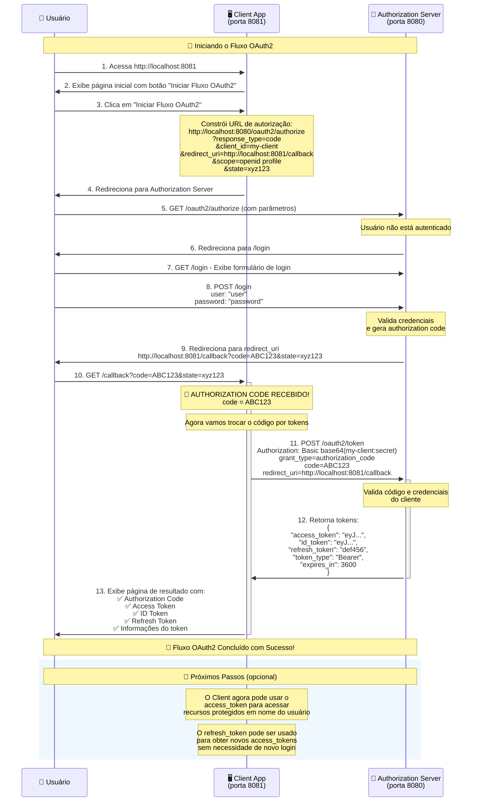

# OAuth2 Authorization Code Flow - Aplicação de Estudo

Este projeto demonstra o fluxo **OAuth2 Authorization Code Grant** usando Spring Authorization Server e um cliente OAuth2 personalizado.

## 📋 Estrutura do Projeto

- **Authorization Server** (porta 8080) - Servidor que autentica usuários e emite tokens
- **Client Application** (porta 8081) - Aplicação cliente que precisa acessar recursos protegidos

## 🔄 Como Funciona o Fluxo OAuth2

```
1. Usuário acessa Client App (8081)
2. Client redireciona para Authorization Server (8080/oauth2/authorize)
3. Usuário faz login no Authorization Server
4. Authorization Server redireciona de volta com código de autorização
5. Client troca o código por access token
6. Client pode usar o token para acessar recursos
```

### 📊 Diagrama de Sequência Detalhado



## ⚙️ Configurações

### Authorization Server (porta 8080)
- **Cliente registrado:** `my-client`
- **Client Secret:** `secret`
- **Redirect URI:** `http://localhost:8081/callback`
- **Scopes:** `openid`, `profile`
- **Usuário de teste:** `user` / `password`

### Client Application (porta 8081)
- **Client ID:** `my-client`
- **Client Secret:** `secret`
- **Authorization Server:** `http://localhost:8080`

## 🚀 Como Executar

### 1. Iniciar o Authorization Server
```bash
# No terminal 1 - rode a aplicação na porta 8080
mvn spring-boot:run -Dserver.port=8080
```

### 2. Iniciar a Client Application
```bash
# No terminal 2 - rode a aplicação na porta 8081
mvn spring-boot:run -Dserver.port=8081
```

### 3. Testar o Fluxo
1. Acesse: `http://localhost:8081`
2. Clique em **"Iniciar Fluxo OAuth2"**
3. Você será redirecionado para `http://localhost:8080/login`
4. Faça login com:
   - **Usuário:** `user`
   - **Senha:** `password`
5. Após o login, você será redirecionado para `http://localhost:8081/callback`
6. Você verá o **Authorization Code** e os **tokens** obtidos

## 📊 O que Você Verá na Tela de Resultado

- ✅ **Authorization Code** - Código temporário recebido
- ✅ **Access Token** - Token para acessar recursos
- ✅ **ID Token** - Token com informações do usuário (OpenID Connect)
- ✅ **Refresh Token** - Para renovar tokens sem novo login
- ✅ **Token Type** - Tipo do token (Bearer)
- ✅ **Expires In** - Tempo de expiração do token

## 🔧 Endpoints Importantes

### Authorization Server (8080)
- `GET /oauth2/authorize` - Iniciar autorização
- `POST /oauth2/token` - Obter tokens
- `GET /login` - Página de login
- `GET /.well-known/oauth-authorization-server` - Metadados

### Client Application (8081)
- `GET /` - Página inicial
- `GET /login` - Redireciona para autorização
- `GET /callback` - Recebe código e troca por token

## 📝 Parâmetros da URL de Autorização

Quando você clica em "Iniciar Fluxo OAuth2", é gerada esta URL:

```
http://localhost:8080/oauth2/authorize?
  response_type=code&
  client_id=my-client&
  redirect_uri=http://localhost:8081/callback&
  scope=openid profile&
  state=xyz123
```

- **response_type=code** - Solicita authorization code
- **client_id** - Identifica a aplicação cliente
- **redirect_uri** - Para onde voltar após login
- **scope** - Permissões solicitadas
- **state** - Proteção contra CSRF

## ⚠️ Importante para Produção

Esta configuração é **APENAS para estudo**! Em produção:

- ✅ Use `BCryptPasswordEncoder` ao invés de `NoOpPasswordEncoder`
- ✅ Armazene clientes e usuários em banco de dados
- ✅ Use HTTPS em todas as URLs
- ✅ Configure secrets seguros e únicos
- ✅ Implemente rate limiting e outras proteções
- ✅ Use JWT com chaves RSA ao invés de chaves simétricas

## 🐛 Troubleshooting

**Erro de redirecionamento:**
- Verifique se as portas 8080 e 8081 estão livres
- Confirme se as URLs de redirect estão exatamente iguais

**Erro de autenticação:**
- Verifique se o Authorization Server está rodando na porta 8080
- Teste o login direto em `http://localhost:8080/login`

**Token inválido:**
- Verifique se client_id e client_secret estão corretos
- Confirme se os escopos solicitados estão permitidos